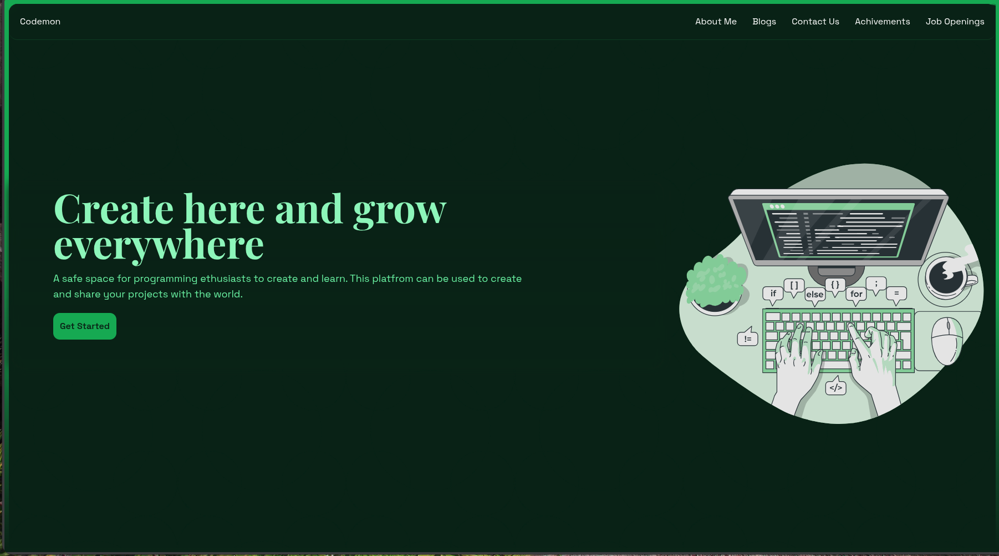

# Codemon

A cloud-based code editor and development environment for programming enthusiasts to create, learn, and share projects.



## Features

- **Monaco Code Editor** - VS Code's editor in the browser with syntax highlighting and IntelliSense
- **Integrated Terminal** - Full xterm.js terminal with real-time shell access via node-pty
- **File Browser** - Navigate and manage project files with an expandable tree view
- **Real-time Sync** - WebSocket-powered communication for instant updates
- **Cloud Storage** - Project files stored on Cloudflare R2 (S3-compatible)
- **Project Templates** - Start with Node.js or Python templates
- **Containerized Execution** - Isolated Docker containers per session, deployed via Kubernetes

## Tech Stack

| Layer | Technologies |
|-------|-------------|
| **Frontend** | Next.js 15, React 19, TailwindCSS 4, Monaco Editor, xterm.js |
| **Backend** | Express, Socket.io, node-pty |
| **Storage** | Cloudflare R2 (AWS S3 SDK) |
| **Infrastructure** | Docker, Kubernetes |
| **Monorepo** | Turborepo, pnpm |

## Project Structure

```
codemon/
├── apps/
│   ├── web/                 # Next.js frontend application
│   │   ├── app/             # App router pages
│   │   │   ├── page.tsx     # Landing page
│   │   │   └── code/        # Code editor page
│   │   └── components/      # React components (FileMenu, etc.)
│   └── websocket/           # Express + Socket.io backend (dev)
│       └── src/
│           ├── index.ts     # WebSocket server entry
│           ├── User.ts      # User session & terminal management
│           ├── Storage.ts   # R2/S3 storage operations
│           └── Local.ts     # Local file operations
├── runner/                  # Docker container for K8s deployment
│   ├── Dockerfile           # Container image definition
│   └── src/
│       ├── index.ts         # WebSocket server entry
│       ├── User.ts          # User session & PTY terminal
│       ├── Storage.ts       # R2 storage operations
│       └── Local.ts         # Local file I/O
├── packages/
│   ├── ui/                  # Shared React component library
│   ├── eslint-config/       # Shared ESLint configurations
│   └── typescript-config/   # Shared TypeScript configurations
└── assets/                  # Project screenshots and media
```

## Getting Started

### Prerequisites

- Node.js >= 18
- pnpm 9.0.0+

### Installation

```bash
# Clone the repository
git clone https://github.com/yourusername/codemon.git
cd codemon

# Install dependencies
pnpm install
```

### Environment Variables

Create a `.env` file in `apps/websocket/` with:

```env
R2_ACCOUNT_NAME=your_cloudflare_account_id
R2_ACCESS_KEY_ID=your_r2_access_key
R2_SECRET_ACCESS_KEY=your_r2_secret_key
```

### Development

```bash
# Start all apps in development mode
pnpm dev
```

This runs:
- **Web app** at `http://localhost:3000`
- **WebSocket server** at `ws://localhost:3003`

### Build

```bash
# Build all apps and packages
pnpm build
```

## Usage

1. Visit the landing page at `http://localhost:3000`
2. Click "Get Started" to enter the code editor
3. A unique session ID is generated for your project
4. Use the file browser to navigate files
5. Edit code in the Monaco editor
6. Run commands in the integrated terminal

## Scripts

| Command | Description |
|---------|-------------|
| `pnpm dev` | Start all apps in development mode |
| `pnpm build` | Build all apps and packages |
| `pnpm lint` | Run ESLint across the workspace |
| `pnpm format` | Format code with Prettier |

## Architecture

```
                                       ┌─────────────────────────────────────┐
                                       │           Kubernetes Cluster        │
┌─────────────────┐     WebSocket      │  ┌─────────────┐ ┌─────────────┐   │
│                 │◄──────────────────►│  │   Runner    │ │   Runner    │   │
│   Next.js Web   │                    │  │    Pod 1    │ │    Pod 2    │   │
│   (Port 3000)   │    Terminal I/O    │  │  (User A)   │ │  (User B)   │   │
│                 │    File Events     │  └──────┬──────┘ └──────┬──────┘   │
└─────────────────┘                    │         │               │          │
                                       └─────────┼───────────────┼──────────┘
                                                 │               │
                                                 ▼               ▼
                                       ┌─────────────────────────────────────┐
                                       │          Cloudflare R2              │
                                       │          (S3 Storage)               │
                                       └─────────────────────────────────────┘
```

## Docker & Kubernetes Deployment

The `runner/` directory contains a production-ready Docker image for deploying isolated code execution environments via Kubernetes.

### Building the Docker Image

```bash
cd runner

# Build the image
docker build -t codemon-runner .

# Push to Docker Hub
docker tag codemon-runner yourusername/codemon-runner:latest
docker push yourusername/codemon-runner:latest
```

### What the Runner Does

- Spawns an isolated PTY terminal (bash) per user session
- Syncs files between local container storage and Cloudflare R2
- Handles real-time code editing with auto-save to cloud
- Provides WebSocket endpoints for terminal I/O and file operations

### Environment Variables (Runner)

```env
R2_ACCOUNT_NAME=your_cloudflare_account_id
R2_ACCESS_KEY_ID=your_r2_access_key
R2_SECRET_ACCESS_KEY=your_r2_secret_key
```

### Kubernetes Integration

Each user session can spin up its own runner pod, providing:
- **Isolation** - Separate containers prevent code interference
- **Scalability** - K8s auto-scales based on demand
- **Resource limits** - Configurable CPU/memory per pod

## License

ISC
